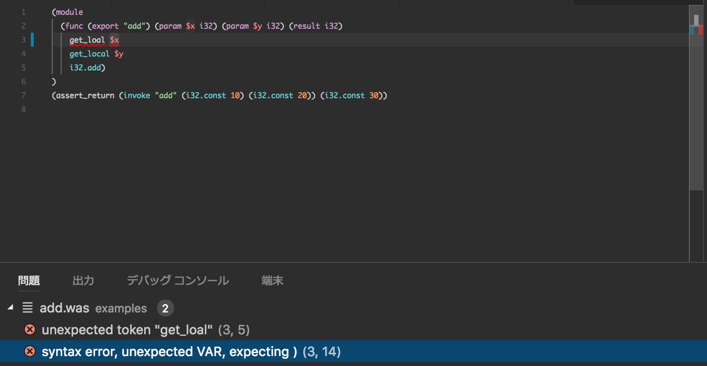
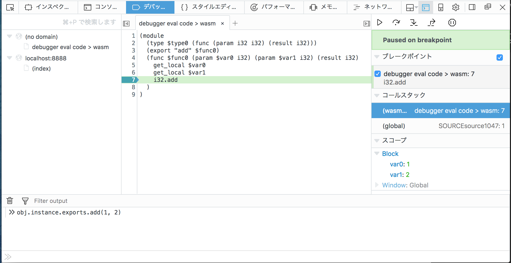

# WebAssemblyをはじめよう

この章では、wastで簡単な例を書いてみて、WebAssemblyの概要をつかんでもらいます。

## 開発環境の構築

まずはWebAssemblyを開発、実行、デバッグするための環境を整えます。

### WABT: The WebAssembly Binary Toolkit

wastからwasmへ変換したり、バイトコードのダンプやモジュールの詳細情報を可視化したりするツールがコマンドラインツールとして提供されています。ちなみに"wabbit"と発音します。

ツール名 | 説明
:---|:---
**wast2wasm** | wastからwasmへ変換する
**wasm2wast** | wasmからwastへ変換する
**wasm-interp** | wasmをデコードしてスタックベースのインタプリタで実行する
**wast-desuger** | 標準化されたインタプリタがサポートするwast（S式、フラット形式、あるいは両方が混在する）をフラット形式に変換する

#### インストール

```
$ git clone --recursive https://github.com/WebAssembly/wabt
$ cd wabt
$ make
```

### Visual Studio Code + vscode-wastのインストール

wastを編集するためのvscode拡張（vscode-wast）を作りましたのでサンプルコードを書くときはVisual Studio Code + vscode-wastを前提として進めていきます。

#### Visual Studio Code

https://code.visualstudio.com/ からVisual Studio Code本体をダウンロードしてインストールします。

#### vscode-wast

コマンドパレットを開いて`ext install wast`と入力してEnterを押してしばらく待つとvscode-wastがインストールされます。

#### wabtの設定

`基本設定 > 設定`から設定を開いて以下の行を追加します。`path/to/wabt`にはgit cloneしてきたwabtレポジトリのルートディレクトリを指定します。

```
"wabtPath": "path/to/wabt" 
```

#### vscode-wastの機能

シンタックスハイライト、保存時のエラーチェックと各種コマンドが用意されています。




##### コマンド

コマンドパレットから実行できるコマンド一覧。

コマンド | タイトル | 説明
:---|:---|:---
`wast.text` | Wast: Run tests | 編集中のファイルをテストする
`wast.dump` | Wast: Print a hexdump | 編集中のファイルのhexdumpを表示する
`wast.info` | Wast: Print a module infomation | 編集中のファイルのモジュール情報を表示する
`wast.build` | Wast: Build a wasm binary | 編集中のファイルを同一ディレクトリにビルドする

### Webブラウザ

実行するだけならChrome、FirefoxのStable版で問題なく動作しますが、developer toolsでデバッグする場合はChrome Canary、Firefox Nightlyの使用を推奨します。どちらも読み込まれたwasmモジュールの可視化、ブレークポイントなどの機能を持っています。試してみた感じでは、Firefox Nightlyのほうが情報量が多いようです。




## 関数を定義する

WebAssemblyのモジュールを作り、整数の足し算を行うadd関数を実装して、JavaScriptから使えるようにエクスポートしてみましょう。

```
(module
  (func
    (export "add")
    (param $x i32) (param $y i32) (result i32)
    get_local $x
    get_local $y
    i32.add)
)
```

上のコードを少しずつ見ていきましょう。`(module ...)`が1つのWebAssemblyモジュールを表します。`(func ...)`で関数を定義していて、次の行の`(export "add")`で`add`というプロパティ名でアクセスできるように関数をエクスポートしています。`(param $x i32) (pram $y i32) (result i32)`は関数の型を表しています。`(param $x i32)`は32bit整数の引数を表し、`$x`というラベルを使って関数内から参照することができます。`(result i32)`は32bit整数を返すことを表します。

次に、`get_local $x ...`からは関数のコード本体部分で、これはスタックマシンの命令列です。具体的には`get_local $x`、`get_local $y`でローカル変数`$x`、`$y`（引数はローカル変数に含まれます）から値を読み込んでスタックにpushし、`i32.add`でスタックから2個の値をpopして足した結果をpushしています。

そして最後に、スタックに積まれている値が関数の戻り値となります。

wastは人間が読み書きするためのコードです。これをJSから読み込んで実行するためにwasm（バイナリ形式のコード）に変換します。上の内容をadd.wastとして保存して、wast2wasm、またはvscode-wastのビルド機能を使用してwasmに変換してみましょう。

```
$ wast2wasm add.wast -o add.wasm
```

wasmファイルは`fetch`（もちろんXHRでも可）でロードし、`WebAssembly.instantiate`を用いて実行可能な形式にコンパイル、インスタンス化してWebブラウザで実行することができます。

```js
fetch("add.wasm")
.then(res => res.arrayBuffer())                  // ArrayBufferとしてロード
.then(buffer => WebAssembly.instantiate(buffer)) // インスタンス化
.then(({module, instance}) => {
  // instance.exportsにエクスポートされたものが入ってきます
  console.log(instance.exports.add(1, 2));       // 3
});
```

## インポートする

WebAssemblyには外部モジュールをインポートする仕組みがあります。`console.log`をラップした関数をインポートとしてモジュール内部で使用してみましょう。

```
(module
  (import "foo" "print" (func $print (param i32)))
  (func (export "bar") (param $x i32)
    get_local $x
    call $print)
)
```

`(import "foo" "print" (func $print (param i32)))`がインポートの宣言です。`"foo"`はインポートするモジュール名、`"print"`がプロパティ名、`(func $print (param i32))`が関数の型を表し、インポートされた関数は`call $print`で呼ばれています。

```js
const importObj = {
  foo: {
    print(x) { console.log(x) }
  }
};

fetch("import.wasm")
.then(res => res.arrayBuffer())
.then(buffer => WebAssembly.instantiate(buffer, importObj))
.then(({module, instance}) => {
  instance.exports.bar(1); // importObj.foo.printが呼ばれます
});
```

外部モジュールをインポートする場合、`WebAssembly.instantiate`の第2引数にインポートするオブジェクトを指定します。オブジェクトの構造とwast内でのインポート宣言が対応していることに注目してください。

## if文的なことをする

いわゆるif文をWebAssemblyで実現するためにはifブロックを使用します。

```
(module
  (fn (export "if") (param $x i32) (result i32)
    get_local $x
    if i32
      i32.const 100
    end
    i32.const 10)

  (fn (export "if_then_else") (param $x i32) (result i32)
    get_local $x
    if i32
      i32.const 100
    else
      i32.const 10
    end)
)
```

`if i32`から`end`までがifブロックを表します。スタックからpopした値が0でない場合のみifブロックに入ります。`if`の直後の`i32`はブロックを抜けるときにpushする値の型で、何もpushしない場合は型の部分を空にしてください。もしelseブロックが存在する場合popした値が0のときにそちらに飛びます。

```js
fetch("if.wasm")
.then(res => res.arrayBuffer())
.then(buffer => WebAssembly.instantiate(buffer))
.then(({module, instance}) => {
  instance.exports.if(1);           // 100
  instance.exports.if(0);           // 10
  instance.exports.if_then_else(1); // 100
  instance.exports.if_then_else(0); // 10
});
```

## switch文的なことをする

いわゆるswitch文をWebAssemblyで実現するためには`block`と`br_table`を組み合わせます。

```
(module
  (func (export "switch") (param $i i32) (result i32)
    block $a
      block $b
        block $c
          get_local $i
          br_table $a $b $c
        end
        i32.const 333
        return
      end
      i32.const 222
      return
    end
    i32.const 111)
)
```

`block`は対応する`end`までのブロックを作ります。`br_table`はネストしたブロックに対してスタックからpopした値をインデックスとして分岐する先を指定します。`$a $b $c`が対象のブロックです。例えば、ローカル変数`$i`が1ならば`$b`のブロックを抜けて222が返ります。

```js
fetch("switch.wasm")
.then(res => res.arrayBuffer())
.then(buffer => WebAssembly.instantiate(buffer))
.then(({module, instance}) => {
  console.log(instance.exports.switch(0)); // 111
  console.log(instance.exports.switch(1)); // 222
  console.log(instance.exports.switch(2)); // 333
});
```

## 再帰呼び出しを行う

再帰関数、例として階乗を求めるfactorial関数を実装してみましょう。

```
(module
  (func $factorial (export "factorial") (param $n i32) (result i32)
    get_local $n
    i32.eqz
    if i32
      i32.const 1
    else
      get_local $n
      get_local $n
      i32.const 1
      i32.sub
      call $factorial
      i32.mul
    end)
)
```

## ループする

ループを実現するためにはloopブロックを使います。上で定義したfactorial関数をループで書き直してみましょう。

```
(module
  (func $factorial_loop (export "factorial_loop") (param $n i32) (result i32)
    (local $ret i32)
    i32.const 1
    set_local $ret
    block $exit
      loop $cont
        get_local $n
        i32.eqz
        br_if $exit
        get_local $ret
        get_local $n
        i32.mul
        set_local $ret
        get_local $n
        i32.const 1
        i32.sub
        set_local $n
        br $cont
      end
    end
    get_local $ret)
)
```

`loop`と、それに対応する`end`までがloopブロックです。いわゆるwhile文のようなものを実装するときは、`block`と合わせて使うことが多いです。`loop`のすぐ後に出てくる`br_if $exit`で終了判定をしていて、真なら外側のブロックを抜けます。`loop`に対応する`end`直前の`br $cont`でloopブロックの先頭に飛びます。`br`などの分岐命令はloopブロックなら先頭に、それ以外のブロックならブロックを抜けると覚えておいてください。

## グローバル変数を使う

モジュール内で共通してアクセスできるグローバル変数を定義することができます。実行する度に値をインクリメントするincrement関数を実装してみましょう。

```
(module
  (global $count (mut i32) (i32.const 0))

  (func (export "increment") (result i32)
    get_global $count
    i32.const 1
    i32.add
    set_global $count
    get_global)
)
```

`(global $count (mut i32) (i32.const 0))`がグローバル変数の定義です。`(mut i32)`は変数のミュータビリティーと型を表し、`(mut hoge)`と書くと値がミュータブルになります。もしもイミュータブルにしたい場合は単純に`i32`と書いてください。`(i32.const 0)`は変数のイニシャライザーで、定数や他のグローバル変数を参照することができます。グローバル変数にアクセスするときは`get_global`、`set_global`を使用します。

```js
fetch("increment.wasm")
.then(res => res.arrayBuffer())
.then(buffer => WebAssembly.instantiate(buffer))
.then(({module, instance}) => {
  console.log(instance.exports.increment()); // 1
  console.log(instance.exports.increment()); // 2
  console.log(instance.exports.increment()); // 3
});
```

## 線形メモリーにアクセスする

データの格納場所として線形メモリーを使うことができます。ロード、ストア命令によってモジュール内部から線形メモリーにアクセスすることができます。n個の32bit整数を合計した値を返すsum関数を実装してみましょう。

```
(module
  (memory (export "mem") 1 2)
  (data (i32.const 0) "\01\00\00\00\02\00\00\00\03\00\00\00")
  (func (export "sum") (param $n i32) (result i32)
    (local $i i32)
    (local $ret i32)
    i32.const 0
    tee_local $ret
    set_local $i
    block $exit
      loop $cont
        get_local $i
        get_local $n
        i32.eq
        br_if $exit
        get_local $i
        i32.const 4
        i32.mul
        i32.load
        get_local $ret
        i32.add
        set_local $ret
        get_local $i
        i32.const 1
        i32.add
        set_local $i
        br $cont
      end
    end
    get_local $ret)
)
```

`(memory (export "mem") 1 2)`がメモリーの定義です。`1 2`はメモリーの初期サイズと最大サイズを表します。メモリーを確保する最小単位は64KBで、この例の場合、初期サイズが64KB、最大サイズが128KBとなります。メモリーのサイズを拡張する場合は`grow_memory`命令、現在のサイズを取得したい場合は`current_memory`命令を使用します。次の行、`(data (i32.const 0) "\01\00\00\00\02\00\00\00\03\00\00\00")`でオフセット0にバイト列`"\01\00\00\00\02\00\00\00\03\00\00\00"`を挿入しています。メモリーからデータを読み込むために`i32.load`を使用していて、具体的にはスタックからpopした値をオフセットして読み込んだデータをスタックにpushしています。その際、バイトオーダーはリトルエンディアンとして扱われます。

```js
fetch("sum.wasm")
.then(res => res.arrayBuffer())
.then(buffer => WebAssembly.instantiate(buffer))
.then(({module, instance}) => {
  const mem = instance.exports.mem;
  console.log(mem.buffer.byteLength);                    // 65536
  const array = new Uint32Array(mem.buffer);
  console.log(instance.exports.sum(3));                  // 6
  array.subarray(0, 10).forEach((x, i) => array[i] = i);
  console.log(instance.exports.sum(10));                 // 45
});
```

メモリーをエクスポートする場合、`WebAssembly.Memory`のインスタンスとしてエクスポートされ、データはArrayBufferとして`buffer`プロパティからアクセスすることができます。

## 関数テーブルを使う

WebAssemblyでは指定した型の要素の参照を持つテーブルを定義できます。現状指定できる型は関数だけで、これは関数テーブルとして利用できます。[switch文的なことをする](#switch文的なことをする)をテーブルを使って書き直してみましょう。

```
(module
  (type $return_i32 (func (result i32)))
  (table (export "tbl") anyfunc 3 4)
  (elem (i32.const 0) $f1 $f2 $f3)

  (func $f1 (result i32) i32.const 111)
  (func $f2 (result i32) i32.const 222)
  (func $f3 (result i32) i32.const 333)

  (func (export "call_indirect") (param $i i32) (result i32)
    get_local $i
    call_indirect $return_i32)
)
```

`(table (export "tbl") anyfunc 3 4)`がテーブルの定義です。`anyfunc`が要素の型で、`3 4`がテーブルの初期要素数と最大要素数を表します。次の行、`(elem (i32.const 0) $f1 $f2 $f3)`でオフセット0に関数の参照`$1 $2 $3`を挿入しています。テーブルから実際に関数を参照して呼び出すためには`call_indirect`命令を使います。`call_indirect`は参照する関数が、関数シグネチャー`$return_i32`を持っていると期待して呼び出します。

```js
fetch("table.wasm")
.then(res => res.arrayBuffer())
.then(buffer => WebAssembly.instantiate(buffer))
.then(({module, instance}) => {
  console.log(instance.exports.call_indirect(0)); // 111
  console.log(instance.exports.call_indirect(1)); // 222
  console.log(instance.exports.call_indirect(2)); // 333
  const tbl = instance.exports.tbl;
  console.log(tbl.get(0)()); // 111
  console.log(tbl.get(1)()); // 222
  console.log(tbl.get(2)()); // 333
});
```

テーブルをエクスポートする場合、`WebAssembly.Table`のインスタンスとしてエクスポートされ、関数の参照は`get`メソッドから取得することができます。
