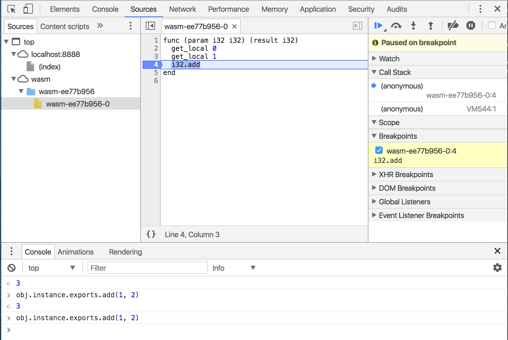

# 開発環境の構築

WebAssemblyを開発、実行、デバッグするための環境を整えます。

## WABT: The WebAssembly Binary Toolkit

wastからwasmへ変換したり、バイトコードのdumpや詳細情報を可視化したりするツールがコマンドラインツールとして提供されています。ちなみに"wabbit"と発音するそうです。

ツール名 | 説明
:---|:---
**wast2wasm** | wastからwasmへ変換する
**wasm2wast** | wasmからwastへ変換する
**wasm-interp** | wasmをデコードしてスタックベースのインタプリタで実行する
**wast-desuger** | 標準化されたインタプリタがサポートするwast（S式、フラット形式、あるいは両方が混在する）をフラット形式（TODO: 説明しているところへのリンク）形式に変換する

### インストール

```
$ git clone --recursive https://github.com/WebAssembly/wabt
$ cd wabt
$ make
```

## Visual Studio Code + vscode-wastインストール

wastを編集するためのvscode拡張（vscode-wast）を作りましたのでサンプルコードを書くときはVisual Studio Code + vscode-wastを前提として進めていきます。

### Visual Studio Code

https://code.visualstudio.com/ からVisual Studio Code本体をダウンロードしてインストールします。

### vscode-wast

コマンドパレットを開いて`ext install wast`と入力してEnterを押してしばらく待つとvscode-wastがインストールされます。

### wabtの設定

`基本設定 > 設定`から設定を開いて以下の行を追加します。`path/to/wabt`にはgit cloneしてきたwabtレポジトリのルートディレクトリを指定します。

```
"wabtPath": "path/to/wabt" 
```

### vscode-wastの機能

シンタックスハイライト、保存時のエラーチェックと各種コマンドが用意されています。


#### コマンド

コマンドパレットから実行できるコマンド一覧。

コマンド | タイトル | 説明
:---|:---|:---
`wast.text` | Wast: Run tests | 編集中のファイルをテストする
`wast.dump` | Wast: Print a hexdump | 編集中のファイルのhexdumpを表示する
`wast.info` | Wast: Print a module infomation | 編集中のファイルのモジュール情報を表示する
`wast.build` | Wast: Build a wasm binary | 編集中のファイルを同一ディレクトリにビルドする

## Webブラウザ

実行するだけなら、Chrome、FirefoxのStable版で問題なく動作しますが、developer toolsでデバッグする場合は、Chrome Canary、Firefox Nightlyの使用を推奨します。どちらも読み込まれたwasmモジュールの可視化、ブレークポイントなどの機能を持っています。試してみた感じでは、Firefox Nightlyのほうが情報量が多いようです。




